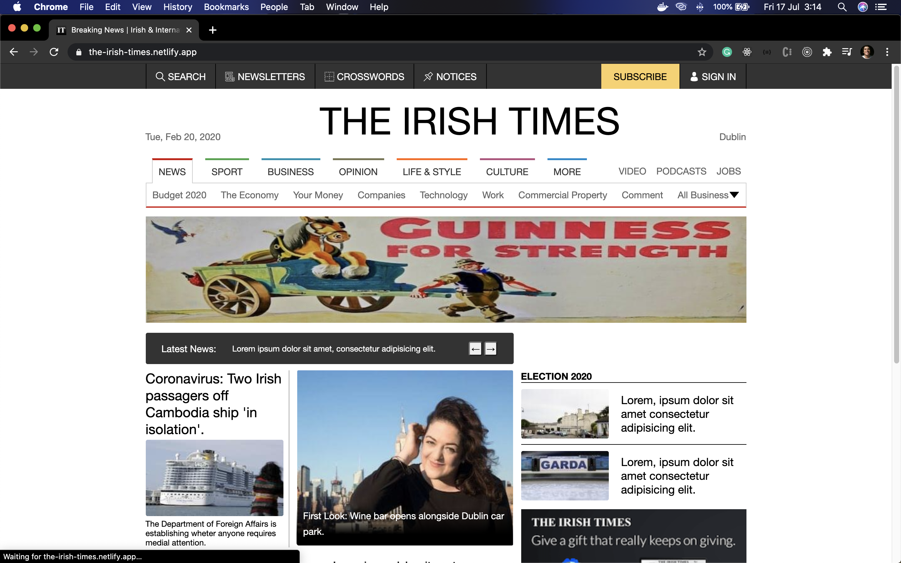
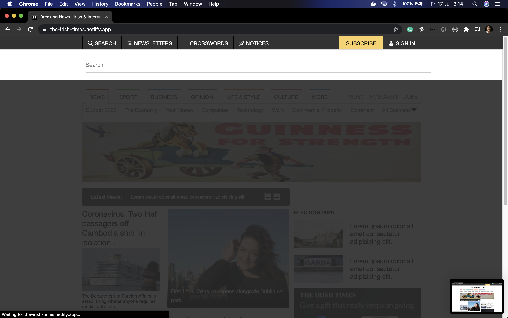
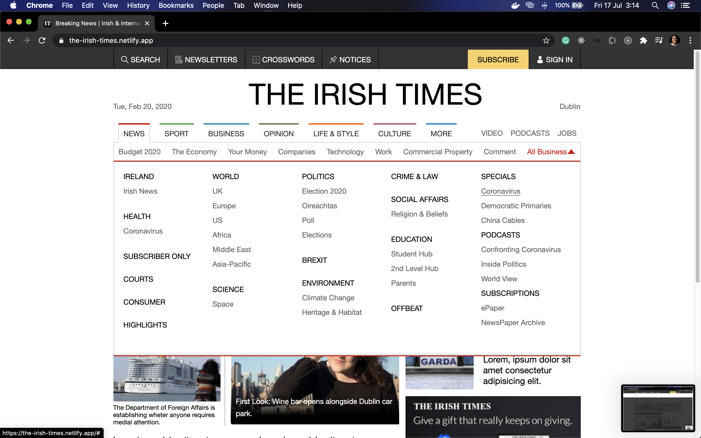
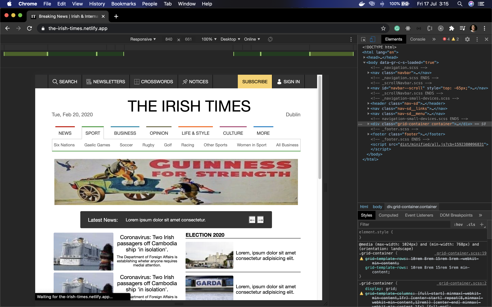
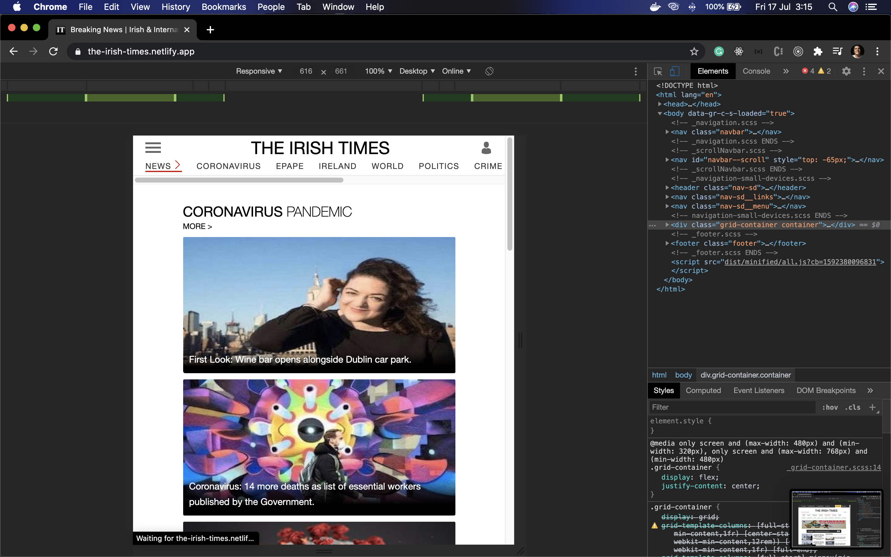
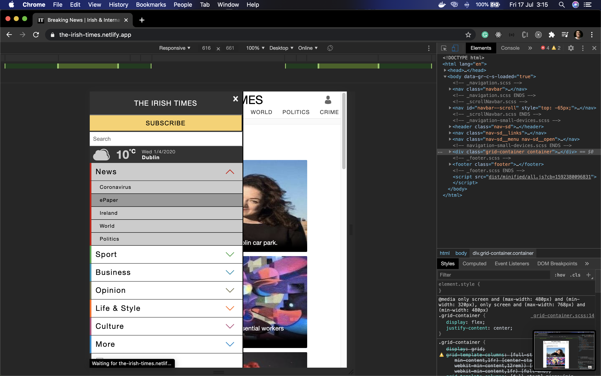
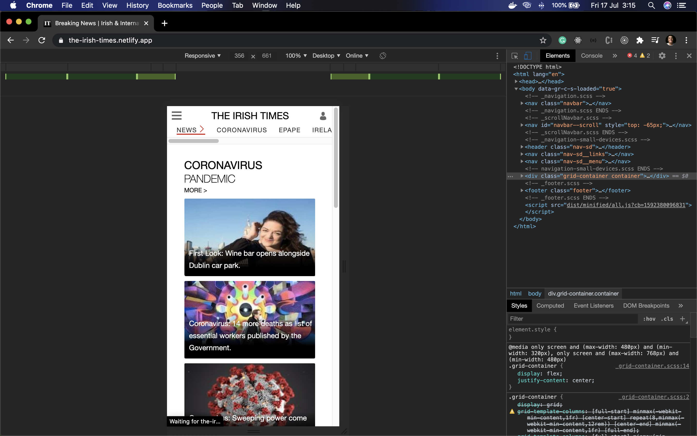

# the-irish-times-home-page

This is a home page that I cloned from [**_The Irish Times_**](https://www.irishtimes.com/).

## About the project

- This is a simple responsive home page.

## The project

In this project I only used pure CSS and VanillaJS with the latest recommendation for meta tags and SEO. I also used [**_Gulp_**](https://gulpjs.com/) to minifiy all my files. 

**Home Page**

**Search**

**Dropdown**

**Responsive**

**Responsive**

**Mobile Menu**

**Mobile**

## Getting started

1.  Prerequisites

- npm

      npm install npm@latest -g

2. Installation

- Clone the repo

      git clone https://github.com/euguilhermegirardi/the-irish-times-home-page.git

3. Install NPM packages

       npm install

4. Run the application

       open localhost
       

## Contributing

1.  Fork the project
2.  Create your feature branch (`git checkout -b feature/AmazingFeature`)
3.  Commit your changes (`git commit -m 'Add some AmazingFeature'`)
4.  Push to the branch (`git push origin feature/AmazingFeature`)
5.  Open a pull request

## License

